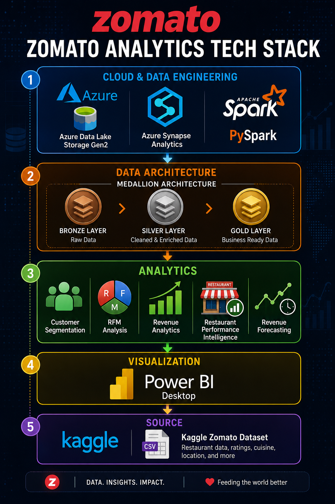
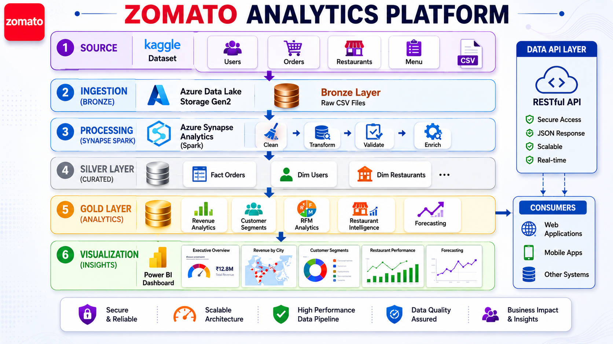
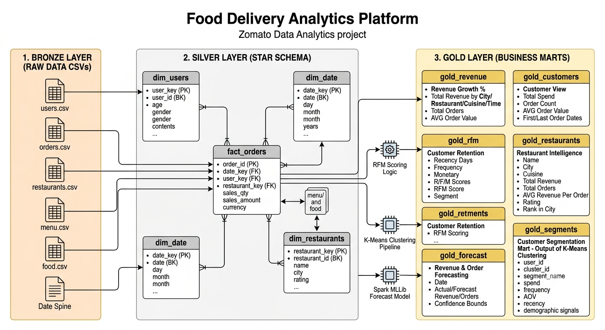
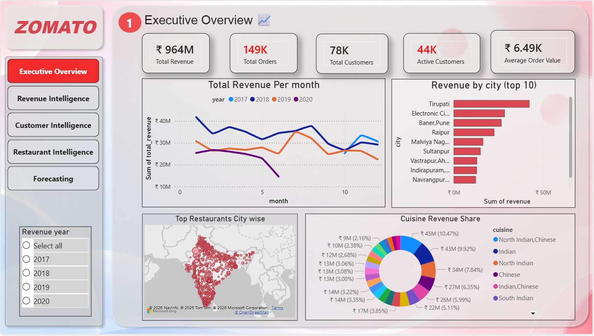
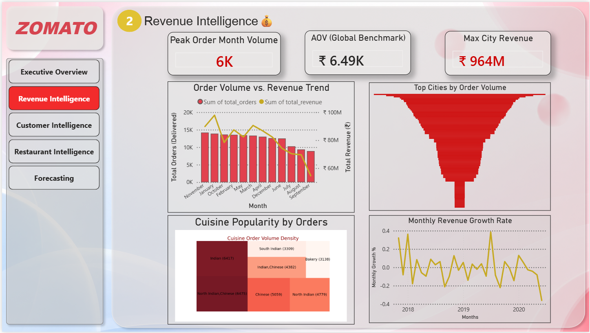
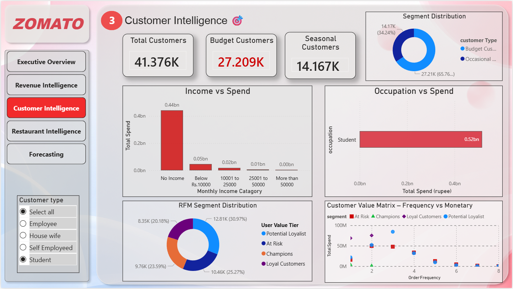
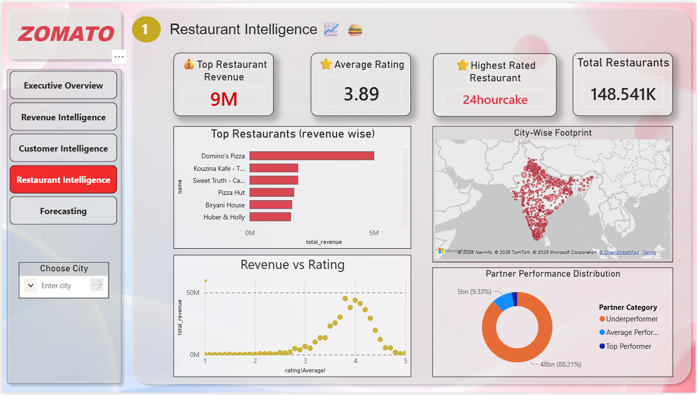
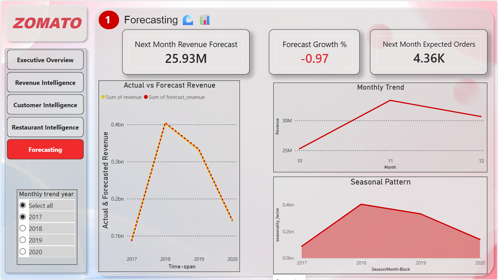

# 🍽️ Zomato Analytics Platform on Azure Synapse
## 📊 Live Power BI Dashboard

Explore the interactive Zomato Analytics Dashboard hosted on Microsoft Fabric:

[](https://app.powerbi.com/links/uUStzvO1i4?ctid=841e991f-1730-433f-82ba-ea7895004ffa&pbi_source=linkShare)

---

⚠️ If the link does not open, you can download the `.pbix` file directly here:  
[](powerbi/Zomato_Analytics.pbix)

---

# 👨‍💻 Author

**Saurav Das**  
_Data Engineering • Analytics Engineering • Cloud Analytics_

[](https://github.com/Sauravdas007)
[](https://www.linkedin.com/in/saurav-das-894046267)



An end-to-end cloud analytics platform built using **Azure Synapse Analytics**, **Azure Data Lake Storage Gen2**, **Apache Spark (PySpark)**, and **Power BI** to transform raw food delivery data into actionable business intelligence.

This project implements a modern **Medallion Architecture (Bronze → Silver → Gold)** and delivers executive-level insights across revenue analytics, customer segmentation, retention analytics, restaurant intelligence, and forecasting.

---

# 🚀 Project Overview

Food delivery platforms generate large volumes of transactional, customer, and restaurant data. Raw operational data alone provides limited business value without proper engineering and analytical processing.

This project demonstrates how a modern cloud analytics platform can transform raw data into executive decision-making insights through scalable data engineering and business intelligence workflows.

---

# 🏗️ Solution Architecture




---

# 🥇 Medallion Architecture



### Bronze Layer

Stores raw source files exactly as received from the source system.

**Datasets**

- Users
- Restaurants
- Orders
- Food
- Menu

### Silver Layer

Stores cleansed, validated, and business-ready entities.

**Tables**

- Dim Users
- Dim Restaurants
- Fact Orders

### Gold Layer

Stores analytical marts optimized for reporting and decision-making.

**Datasets**

- executive_kpis
- revenue_monthly
- revenue_city
- revenue_cuisine
- customer_segments
- rfm_customers
- restaurant_intelligence
- top_restaurants
- revenue_forecast
- monthly_forecast
- forecast_base

---

# 🛠️ Tech Stack

| Category | Technologies |
|-----------|-------------|
| Cloud | Microsoft Azure |
| Storage | Azure Data Lake Storage Gen2 |
| Processing | Azure Synapse Analytics, Apache Spark, PySpark |
| Storage Format | Parquet |
| Architecture | Medallion Architecture, Star Schema |
| Visualization | Power BI Desktop |

---

# 📊 Business Problems Solved

## Revenue Growth Optimization

**Business Question**

How can the platform increase revenue by understanding customer spending patterns and restaurant performance?

**Outputs**

- Revenue Trends
- Revenue by City
- Revenue by Cuisine
- Top Revenue Restaurants
- Average Order Value

---

## Customer Segmentation

**Business Question**

Can customers be grouped into meaningful segments for targeted marketing?

**Segments**

- Premium Customers
- Budget Customers
- Frequent Buyers
- Occasional Buyers

---

## Customer Retention Analytics

**Business Question**

Which customers are highly loyal and which are becoming inactive?

**Metrics**

- Recency
- Frequency
- Monetary (RFM)

**Outputs**

- Loyal Customers
- Active Customers
- At-Risk Customers

---

## Restaurant Performance Intelligence

**Business Question**

Which restaurant partners drive the most value to the platform?

**Metrics**

- Revenue
- Orders
- Ratings
- Rating Count
- Cost Range

---

## Demand & Revenue Forecasting

**Business Question**

What will future order demand and revenue look like?

**Forecasts**

- Revenue Forecasting
- Monthly Demand Forecasting
- Trend Analysis
- Seasonal Insights

---

## Executive Analytics Platform

**Business Question**

How can leadership obtain a unified view of platform performance?

**Dashboard Coverage**

- Revenue Analytics
- Customer Analytics
- Restaurant Intelligence
- Retention Analytics
- Forecasting Analytics

---

# 📈 Dashboard Preview

## 📸 Dashboard Pages

| Dashboard Overview | Revenue Intelligence | Customer Intelligence |
|--------------------|----------------------|-----------------------|
|  |  |  |

| Restaurant Intelligence | Forecasting Analytics |
|-------------------------|-----------------------|
|  |  |


### Dashboard Features

- Revenue Intelligence
- Customer Segmentation
- Customer Retention (RFM)
- Restaurant Performance Analytics
- Revenue Forecasting
- Executive KPI Monitoring

---

# 📁 Repository Structure

```text
zomato-analytics-platform/
│
├── README.md
│
├── docs/
│   ├── solution-architecture.md
│   ├── architecture-decisions.md
│   ├── business-problems.md
│   ├── dashboard-guide.md
│   └── images/
│       ├── architecture.png
│       ├── medallion-architecture.png
│       ├── dashboard-overview.png
│       └── tech-flow.png
│
├── notebooks/
│   ├── 01_bronze_ingestion.ipynb
│   ├── 02_bronze_to_silver_users.ipynb
│   ├── 03_bronze_to_silver_restaurants.ipynb
│   ├── 04_bronze_to_silver_fact_orders.ipynb
│   ├── 05_gold_revenue_analytics.ipynb
│   ├── 06_gold_customer_segmentation.ipynb
│   ├── 07_gold_customer_retention.ipynb
│   ├── 08_gold_restaurant_intelligence.ipynb
│   ├── 09_gold_forecasting.ipynb
│   └── 10_gold_executive_kpis.ipynb
│
├── powerbi/
│   └── Zomato_Analytics.pbix
│
└── scripts/
    └── profiling.py
```

---

# 📚 Documentation

Detailed project documentation is available under the `docs/` directory.

| Document | Description |
|-----------|------------|
| solution-architecture.md | End-to-end platform architecture |
| architecture-decisions.md | Technology choices and trade-offs |
| business-problems.md | Business use cases and solutions |
| dashboard-guide.md | Dashboard walkthrough and KPI explanations |

---

# 📦 Dataset

Dataset sourced from Kaggle:

**Dataset Link:**  
<PASTE_KAGGLE_DATASET_LINK_HERE>

---

# ⭐ Key Highlights

- Built an end-to-end analytics platform on Azure Synapse Analytics.
- Implemented Bronze, Silver, and Gold layers using Medallion Architecture.
- Processed 1.9M+ records across multiple datasets.
- Developed Spark-based ETL pipelines using PySpark.
- Created analytical marts for revenue, customer, restaurant, and forecasting analytics.
- Implemented customer segmentation and RFM-based retention models.
- Built executive dashboards in Power BI.
- Designed scalable cloud-native data pipelines using Azure Data Lake Storage Gen2.

---
